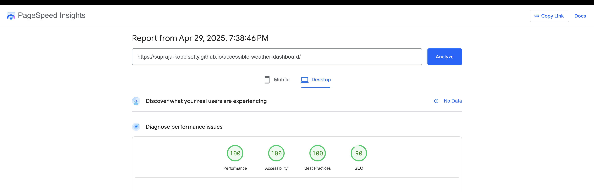

# 🌦️Accessible Weather Dashboard

A real-time weather application with a focus on inclusivity and predictive analytics.

Predictive Insights: Uses a Scikit-Learn Random Forest model to predict temperature trends.

Accessibility-First: Designed with ARIA labels, full keyboard navigation, and WCAG 2.1 AA compliance.

Performance: Achieved a perfect or near-perfect Lighthouse Accessibility score.

[Live Demo](https://supraja-koppisetty.github.io/accessible-weather-dashboard/)

## 💻 Tech Stack

Frontend: React.js, Vite, Tailwind CSS

Backend: Python, Flask

ML: Scikit-Learn (Random Forest Regressor)

API: OpenWeatherMap API

## 📊 Lighthouse Accessibility Score



## Getting Started:

### 1. Clone the repository:

```bash
git clone [https://github.com/Supraja-Koppisetty/accessible-weather-dashboard.git](https://github.com/Supraja-Koppisetty/accessible-weather-dashboard.git)
cd accessible-weather-dashboard
```

### 2. Frontend Setup

```bash
 cd frontend
 npm install
 npm run dev
```

### 3. Backend Setup:

```bash
cd ../backend
python3 -m venv venv
source venv/bin/activate
pip install --upgrade pip
pip install -r requirements.txt # On Windows use: venv\Scripts\activate
```

Download the python model from the below link and place it in the `backend` folder :
https://github.com/Supraja-Koppisetty/accessible-weather-dashboard/releases/download/python-model-release-build/temperature_prediction_model_rf.pkl

```bash
python app.py
```
